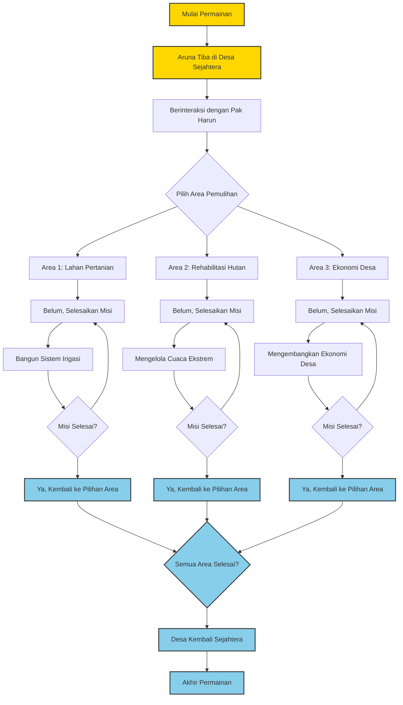

# FarmingAdvanture_game_unity 🎮 - Farm Team 🌾

**Farm Adventure** adalah game simulasi berbasis Unity yang menggabungkan elemen bertani, manajemen sumber daya, dan keberlanjutan lingkungan. Pemain berperan sebagai Aruna, seorang petani muda yang berjuang untuk memulihkan desa Sejahtera dari kehancuran akibat eksploitasi berlebihan. Dengan bimbingan tokoh desa, pemain menjalankan misi untuk membangun kembali desa dan mengajarkan pentingnya pertanian berkelanjutan.


# 📖 Sinopsis
Aruna tiba di **Desa Sejahtera**, tempat yang dulunya subur namun kini terlantar akibat eksploitasi berlebihan. Dengan bantuan Pak Harun (tetua desa), Nala (anak kecil penuh semangat), dan Bu Nina (pedagang pasar lokal), Aruna menghadapi tantangan untuk menghidupkan kembali desa. Pemain akan memulihkan lahan, mengelola sumber daya, dan membangun kembali ekonomi desa untuk menciptakan kehidupan yang harmonis dan berkelanjutan.

## 🎮 Fitur Utama
1. Simulasi Bertani
   - Menanam dan memanen lebih dari 50 jenis tanaman organik.
   - Membangun sistem irigasi hemat air.
   - Mengelola sumber daya seperti air dan pupuk organik.
  
2. Misi dan Tantangan
   - Menghidupkan kembali 3 area kosong dengan tanaman dan pohon.
   - Menghadapi cuaca ekstrem seperti kemarau panjang dan badai.
   - Membangun fasilitas desa seperti gudang dan pasar lokal.

3. Sistem Ekonomi Desa
   - Menjual hasil panen ke pasar untuk mendapatkan keuntungan.
   - Menggunakan keuntungan untuk meningkatkan kesejahteraan desa.

4. Karakter Interaktif
   - Berinteraksi dengan NPC seperti Pak Harun, Nala, dan Bu Nina untuk mendapatkan panduan dan cerita menarik.


## 🎓 Tujuan dan Capaian
- Tujuan
Mengajarkan pentingnya pertanian berkelanjutan, perdagangan adil, dan menjaga lingkungan sambil memperbaiki ekonomi desa.

- Capaian
**Pemain akan memahami:**
  - Cara mengelola lahan secara berkelanjutan.
  - Teknik bertani hemat air.
  - Pentingnya perdagangan adil.
  - Dampak aktivitas pertanian terhadap lingkungan.
 
## 🛠️ Teknologi yang Digunakan
- **Engine**: Unity
- **Bahasa Pemrograman**: C#
- **Desain Visual**: Canva, Photoshop
- **Sistem Audio**: FMOD Studio
- **Manajemen Proyek**: Trello, Github


## 📅 Timeline Project

Berikut adalah rencana dan tahapan pengembangan **Farm Adventure**:

| **Tahap**                     | **Kegiatan**                                                                                                                                   | **Status**        | **Keterangan**                                                                                                                                                 |
|-------------------------------|-----------------------------------------------------------------------------------------------------------------------------------------------|-------------------|----------------------------------------------------------------------------------------------------------------------------------------------------------------|
| **Perencanaan dan Persiapan** | - Finalisasi ide cerita dan misi game.                                                                                                        | **Done**          | Dokumentasi desain game (GDD - Game Design Document) selesai dibuat. <br> [Dokumentasi GDD](https://www.canva.com/design/DAGWxDIuc8I/2IAT8I9heQHa1xOnlvAZvQ/edit)|
|                               | - Membuat wireframe dan storyboard untuk alur game.                                                                                          |                   |                                                                                                                                                                |
|                               | - Membagi tugas ke setiap anggota tim.                                                                                                       |                   |                                                                                                                                                                |
| **Desain dan Pengembangan Awal** | - Game Designer: Merancang mekanik gameplay dan prototipe misi.                                                                             | **On Progress**   |                                                                                                                                                                |
|                               | - Artist: Mendesain elemen visual utama seperti karakter, lingkungan, dan UI.                                                                |                   |                                                                                                                                                                |
|                               | - Programmer: Membuat struktur dasar game menggunakan Unity.                                                                                 |                   |                                                                                                                                                                |
|                               | - Sound Designer: Memulai pembuatan efek suara awal.                                                                                         |                   |                                                                                                                                                                |
| **Integrasi dan Testing Awal** | - Mengintegrasikan desain visual dengan prototipe gameplay.                                                                                  | **Belum Dimulai** | Akan dimulai setelah prototipe gameplay selesai.                                                                                                               |
|                               | - Mengembangkan mekanisme irigasi, manajemen sumber daya, dan sistem ekonomi.                                                                 |                   |                                                                                                                                                                |
|                               | - Melakukan testing internal untuk mendeteksi bug dan memperbaiki alur gameplay.                                                              |                   |                                                                                                                                                                |
| **Penyempurnaan dan Demo Final** | - Penyempurnaan grafik dan animasi.                                                                                                         | **Belum Dimulai** | Tahap terakhir sebelum rilis.                                                                                                                                 |
|                               | - Finalisasi efek suara dan musik latar.                                                                                                     |                   |                                                                                                                                                                |
|                               | - Testing akhir untuk memastikan semua fitur berjalan lancar.                                                                                |                   |                                                                                                                                                                |
|                               | - Menyiapkan demo game untuk presentasi atau distribusi awal.                                                                                |                   |                                                                                                                                                                |


## 🌟 Tim Pengembang

Berikut adalah anggota tim yang berkontribusi dalam pengembangan **Farm Adventure**:

| **Nama**                    | **Peran**            | **Tugas Utama**                                                    |
|-----------------------------|----------------------|--------------------------------------------------------------------|
| **Raka Agi Saputra**        | Project Manager      | Mengelola proyek, mengawasi jalannya pengembangan, dan memastikan setiap tahap proyek selesai tepat waktu. |
| **Muhammad Alvin Brianda**  | Game Designer        | Merancang mekanik gameplay, misi, dan alur cerita yang menarik.   |
| **M. Rasyd Ridho**          | Programmer           | Mengembangkan logika game, mekanisme gameplay, dan sistem backend menggunakan Unity dan C#. |
| **Rifqi Al Ghani**          | Sound Designer       | Membuat efek suara, musik latar, dan elemen audio yang imersif.   |
| **Fabia Yuwenbi**           | Artist               | Mendesain elemen visual termasuk karakter, lingkungan, dan antarmuka pengguna (UI). |

## 🛠️ Proses Kerja Setiap Role

### 1. Project Manager - Raka Agi Saputra
**Tugas Utama:**
- Memastikan proyek berjalan sesuai rencana.
- Menyusun timeline, target, dan milestone.
- Berkoordinasi dengan semua anggota tim.

**Proses Kerja:**
- Membuat dan memantau timeline proyek.
- Mengevaluasi perkembangan proyek.
- Memastikan dokumentasi proyek (GDD, laporan perkembangan) selalu terbarui.
- Menyelesaikan kendala lintas role.

---

### 2. Game Designer - Muhammad Alvin Brianda
**Tugas Utama:**
- Mendesain alur cerita, mekanik gameplay, dan misi.
- Membuat Game Design Document (GDD).

**Proses Kerja:**
- Mengidentifikasi target audiens dan membuat konsep gameplay.
- Menyusun alur cerita utama dan misi tambahan.
- Membuat wireframe dan flowchart alur gameplay.
- Menguji prototipe gameplay untuk memastikan keasyikan permainan.

---

### 3. Programmer - M. Rasyd Ridho
**Tugas Utama:**
- Mengembangkan logika dan mekanisme game.
- Mengimplementasikan sistem gameplay di Unity.

**Proses Kerja:**
- Membuat struktur kode utama untuk proyek menggunakan Unity (C#).
- Mengintegrasikan desain visual dengan logika gameplay.
- Mengembangkan fitur utama seperti:
  - Sistem irigasi dan manajemen sumber daya.
  - Interaksi pemain dengan lingkungan.
- Debugging untuk memastikan kode berjalan tanpa error.

---

### 4. Sound Designer - Rifqi Al Ghani
**Tugas Utama:**
- Membuat efek suara dan musik latar yang sesuai dengan tema game.

**Proses Kerja:**
- Mengumpulkan referensi audio yang cocok untuk suasana permainan.
- Membuat efek suara untuk aksi seperti menanam, panen, hujan, atau badai.
- Menyusun musik latar untuk menciptakan pengalaman bermain yang imersif.
- Mengintegrasikan audio ke dalam game melalui Unity.

---

### 5. Artist - Fabia Yuwenbi
**Tugas Utama:**
- Mendesain elemen visual, karakter, dan lingkungan.

**Proses Kerja:**
- Membuat konsep art untuk karakter (Aruna, NPC), lingkungan, dan aset pendukung.
- Mendesain antarmuka pengguna (UI) seperti menu, indikator, dan peta.
- Mengoptimalkan aset visual agar sesuai dengan performa Unity.
- Berkolaborasi dengan programmer untuk memastikan elemen visual terintegrasi dengan baik.


## 🚀 Cara Menggunakan

Ikuti langkah-langkah berikut untuk menjalankan proyek **Farm Adventure**:

1. **Clone repository ini**:
   ```bash
   git clone https://github.com/FarmAdventureTeam/FarmAdventure.git
   ```
2. Buka proyek di Unity:
   - Gunakan Unity versi  Unity 6
3. Sinkronisasi dependensi:
   - Pastikan semua plugin dan library telah terunduh melalui Unity Package Manager.
4. Jalankan proyek:
   - Tekan tombol Play di Unity Editor untuk memulai pengujian.
5. Build game:
   - Pergi ke menu File > Build Settings.
   - Pilih platform target (PC, Android, iOS), lalu klik Build.


## :star: Gabung sebagai Kontributor
1. Cek branch yang tersedia:
   ```bash
   git branch
2. Buat branch baru
   ```bash
   git branch nama_kontibutor
3. Pilih branch baru dengan nama kontributor:
   ```bash
   git checkout nama_kontributor
4. Tambahkan perubahan ke staging area:
   ```bash
   git add .
5. Commit perubahan dengan pesan deskriptif:
   ```bash
   git commit -m "nama_kontributor: Deskripsi perubahan"
6. Push branch ke repository:
   ```bash
   git push origin nama_kontributor
7. Lakukan pull untuk memastikan branch Anda selalu terbarui dengan perubahan terbaru:
   ```bash
   git pull origin main

***Noted: origin main hanya digunakan satu kali saat awal***
***Setelah itu hanya:***
```bash
   git push
   git pull
```

# 🌟 Flowchart Alur Game - Farm Adventure 🎮



# **Farm Adventure: Petualangan Aruna**

## 1. Mulai Permainan
- Pemain memulai permainan sebagai **Aruna**, seorang petani muda yang baru tiba di **Desa Sejahtera**.
- Desa Sejahtera dulunya makmur, tetapi kini terlantar akibat eksploitasi sumber daya yang berlebihan.
- Pemain bertemu dengan **Pak Harun**, tetua desa yang memberikan gambaran tentang kondisi desa.
- Pak Harun menjelaskan ada tiga area utama yang harus dipulihkan:
  - **Area 1: Lahan Pertanian**
  - **Area 2: Rehabilitasi Hutan**
  - **Area 3: Ekonomi Desa**

---

## 2. Pilihan Area Pemulihan
- Pemain bebas memilih salah satu dari tiga area untuk dipulihkan terlebih dahulu.
- Setiap area memiliki **misi spesifik** dan **tantangan unik**:

### a. **Area 1: Lahan Pertanian**
- **Misi**:
  - Membersihkan lahan dan mempersiapkannya untuk bercocok tanam.
  - Menanam dan memanen berbagai tanaman organik.
  - Membuat sistem irigasi hemat air untuk keberlanjutan.
  - Menjual hasil panen ke pasar lokal untuk mendapatkan keuntungan.
  
### b. **Area 2: Rehabilitasi Hutan**
- **Misi**:
  - Melakukan reboisasi dengan menanam berbagai jenis pohon.
  - Menghadapi tantangan cuaca ekstrem seperti badai dan kemarau.
  - Mengelola sumber daya agar pohon yang ditanam dapat tumbuh dengan baik.
  
### c. **Area 3: Ekonomi Desa**
- **Misi**:
  - Membangun pasar lokal untuk mendukung ekonomi masyarakat.
  - Bekerja sama dengan NPC seperti **Bu Nina** untuk meningkatkan perdagangan.
  - Membantu masyarakat memasarkan hasil pertanian mereka.

---

## 3. Progresi dan Penyelesaian
- **Progress Bar**: Setiap area memiliki progress bar yang menunjukkan kemajuan misi.
- Setelah menyelesaikan satu area, pemain kembali ke Desa Sejahtera untuk memilih area lain.
- Semua area harus diselesaikan untuk mencapai akhir permainan.

---

## 4. Akhir Permainan
- Setelah semua area dipulihkan:
  - Desa kembali menjadi **makmur** dengan pertanian hemat air, hutan hijau, dan ekonomi stabil.
  - Pemain mendapat pujian dari NPC seperti **Pak Harun**, **Nala**, dan **Bu Nina** atas keberhasilannya.
- **Pesan Moral**:
  - Pentingnya pengelolaan sumber daya yang bijak.
  - Keberlanjutan lingkungan.
  - Perdagangan yang adil.

---

## **Elemen Penting dalam Alur**

### 1. **Pilihan Pemain**
- Pemain bebas memilih urutan penyelesaian area, memberikan fleksibilitas dan pengalaman yang personal.

### 2. **Interaksi dengan NPC**
- Pemain berinteraksi dengan NPC untuk mendapatkan:
  - **Panduan.**
  - **Cerita tambahan.**
  - **Reward.**

### 3. **Tantangan dan Reward**
- **Tantangan**:
  - Cuaca ekstrem (kemarau, badai).
  - Pengelolaan sumber daya seperti air, pupuk, dan uang.
- **Reward**:
  - Keuntungan dari hasil panen.
  - Peningkatan ekonomi dan kesejahteraan desa.

---

## **Pesan Akhir**
Farm Adventure memberikan edukasi tentang:
- Pentingnya **pertanian berkelanjutan**.
- Dampak **eksploitasi sumber daya** terhadap lingkungan.
- Manfaat **perdagangan adil** dalam membangun ekonomi yang kuat.


